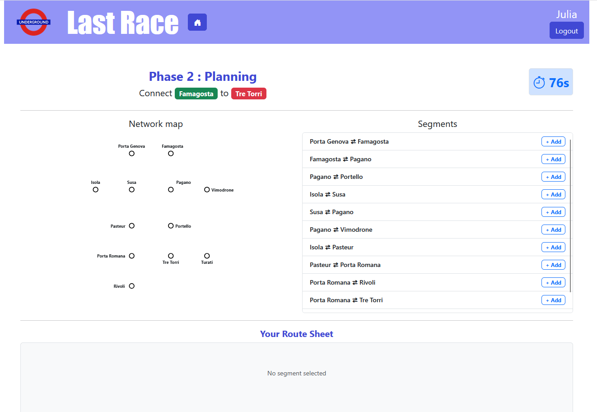
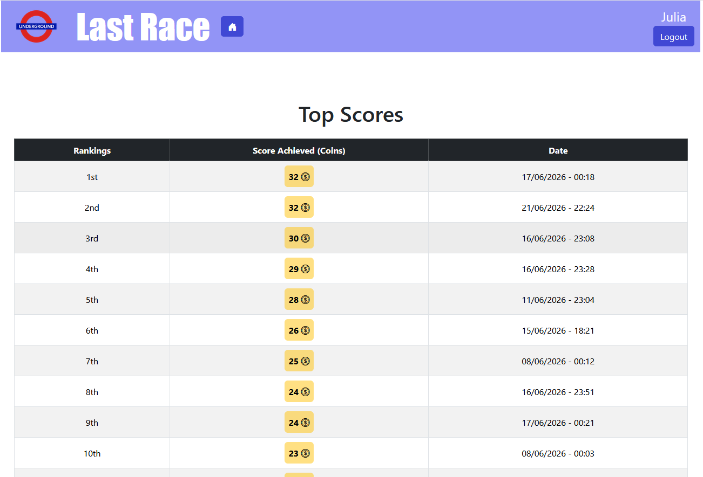

# Exam #1: "Last Race"
## Student: s362220 PESENTI-BOLO CAMILLE 

## React Client Application Routes

- Route `/`: public landing page. Displays the WelcomePage component with game instructions for anonymous users and visitors. If a user is already logged in they are automatically redirected to '/home'.

- Route `/login`: page for the login

- Route `/logout`: logout action page. Redirects the user back to the public landing page ('/').

- Route `/home`: main user dashboard. Displays the HomeView component with navigation buttons to either start a new game or view the leaderboard. Protected route, non-authenticated users are redirected to '/'.

- Route `/ranking`: leaderboard page. Displays the RankingView component, which shows the score history and rankings of all previous games played by the user. Protected route, non-authenticated users are redirected to '/'

- Route `/game`: Core gameplay page. Displays the GameLayout component which manages all gameplay phases (Setup, Planning countdown, and Results with random events). Protected route, non-authenticated users are redirected to '/'


## API Server

## Authentication

### POST /api/sessions

- Description: Authenticates a user using credentials (login).

- Request parameters: None.

- Request body content :
```json
{
  "username": "player1",
  "password": "password123"
}
```

- Response body content (201 Created):
```json
{
  "id": 1,
  "name": "player1"
}
```

### GET /api/sessions/current

- Description: Retrieves information about the currently logged-in user session

- Response body content (200 OK):

```json
{
  "id": 1,
  "name": "player1"
}
```

- Error response (401 Unauthorized): If no user is logged in.

### DELETE /api/sessions/current

- Description: Destroys the current user session (logout).

- Response body content : Empty body (res.end()).

## Global Ranking

### GET /api/ranking

- Description: Fetches the full score history and general leaderboard rankings for the authenticated user

- Response body content (200 OK):

```json
{
  "gameId": 12, "score": 25, "date": "2026-06-20"
}
```

## Game Logic & Map Management

### GET /api/network/setup

- Description: Retrieves the base network graph (all available stations and track segments) to render the preview map

- Response body content (200 OK):

```json
{
  "stations": [ { "id": 1, "name": "Porta Genova" }, { "id": 2, "name": "Famagosta" } ],
  "segments": [ { "id": 101, "station1_name": "Porta Genova", "station2_name": "Famagosta" } ]
}
```

### POST /api/games/start

- Description: Initializes a new game. The server selects a random start station and guarantees a destination station located at a minimum distance

- Response body content (201 Created):

```json
{
  "gameId": 42,
  "startStation": "Porta Genova",
  "destinationStation": "Turati",
  "stations": ["Porta Genova", "Famagosta", "Pagano", "Turati"],
  "segments": [{ "id": 1, "station1": "Porta Genova", "station2": "Famagosta" }]
}
```

### POST /api/games/:id/validate

- Description: Submits the user's selected path for verification. It verifies the 90-second countdown threshold, validates route continuity from origin to target, steps through random events per segment, and commits the finalized score.

- Request parameters: id of the game session

- Request body content:

```json
{
  "route": [{ "station1": "Porta Genova", "station2": "Famagosta" }]
}
```

- Response body content (200 OK - Valid and Complete Route):
```json
{
  "isValid": true,
  "finalScore": 25,
  "steps": [{"segment": "Porta Genova ⇄ Famagosta","eventDescription": "Train delayed due to heavy rain.","effect": -2, "currentCoins": 18}]
}
```

- Response body content (200 OK - Invalid Route or Time Expired):
```json
{
  "isValid": false,
  "reason": "Invalid or interrupted route (stations do not follow each other or do not reach the destination)",
  "finalScore": 0,
  "steps": []
}
```

- Error response (422 Unprocessable Entity): sent when the route payload is missing or is not formatted as an array


## Database Tables

- Table `users` - contains id, username, password, salt
- Table `stations` - contains id, name
- Table `segments` - contains id, station1_name, station2_name
- Table `lines` - contains id, name
- Table `line_stations` - contains line_id, station_id, position_station
- Table `games` - contains id, user_id, start_station_id, end_station_id, score, status, start_time
- Table `events` - contains id, description, effect


## Main React Components

- `Header` (in `Header.jsx`): displays the home button and login/logout button
- `LoginForm` (in `LoginForm.jsx`): login of the user
- `WelcomePage` (in `WelcomePage.jsx`): displays game instructions far anonymous users/visitors
- `HomeView` (in `HomeView.jsx`): displays the buttons to choose between starting a new game and viewing the rankings
- `RankingView` (in `RankingView.jsx`): displays the ranking of all the player's previous games
- `GameLayout` (in `GameLayout.jsx`): displays the game (all the phases of the game)


## Screenshot

- During the game



- Ranking page 



## Users Credentials

- Julia, pass
- Lucas, abc
- Alba, 1234

## Use of AI Tools
During this project, some AI was used to assist with debugging, layout design, and translation. Specifically it helped find coding errors that were hard to trace manually. It also speeded up frontend development by helping with some component building, text styling, and element positioning. Finally it was also used to some translate text, for example to ensure clear game instructions.
